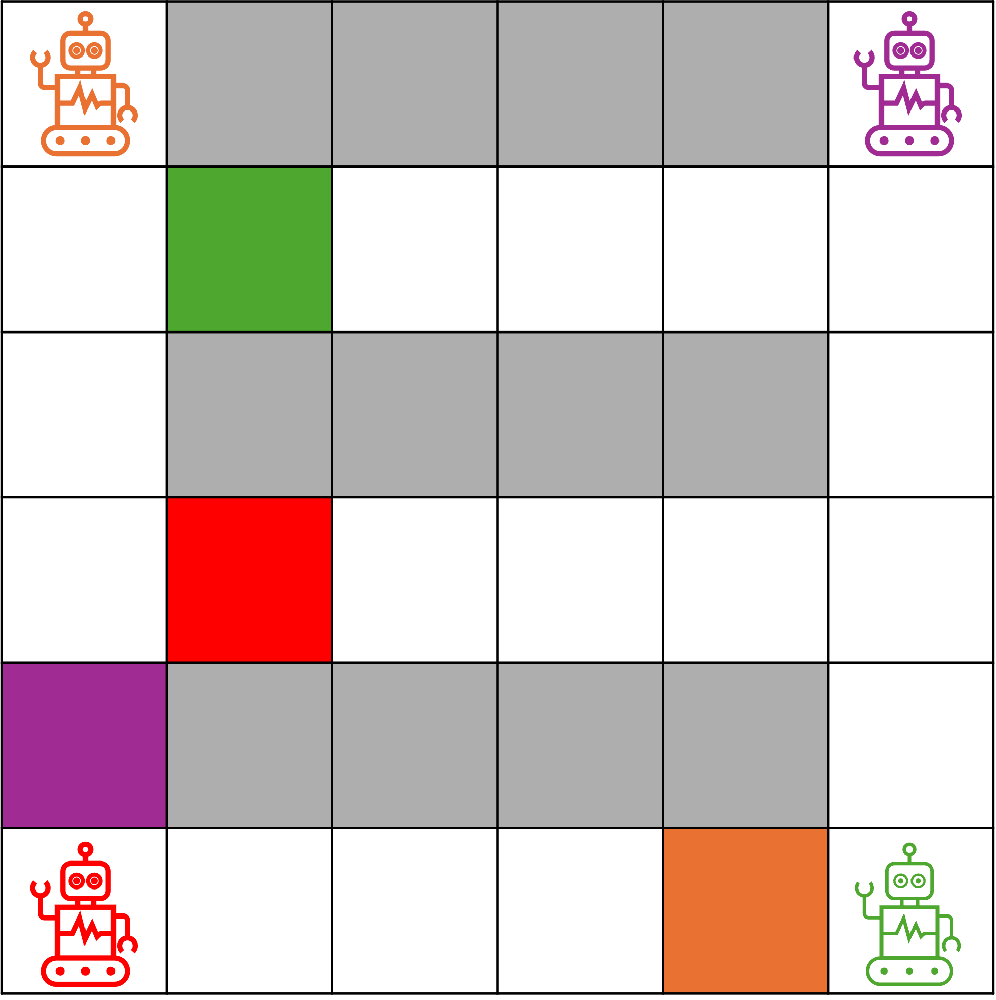

# 使い方
本ライブラリはpython uvを使って依存関係を管理しています。
1. ```uv {仮想環境名（なんでもよい、venvなど）}```として仮想環境を作り, その中に入る
2. ```uv sync```で必要なパッケージをインストール
3. config.pyで各種設定を行った後, 
    1. MATを実行したい場合は```uv run main.py --share_policy --algorithm_name MAT```
    2. RMAPPOを実行したい場合は```uv run main.py --share_policy --algorithm_name RMAPPO```
    3. IPPOを実行したい場合は```uv run main.py --algorithm_name IPPO```


# DemoUserの環境

使い方の例を示す。Demo Userのタスクとしてマルチエージェント経路計画を用意してある。
- オレンジ、紫、赤、緑のエージェントは必ず決まった位置からスタートする。
- 図の赤エージェントがいるエージェントが(0, 0)で、緑が(5, 0)、紫が(5, 5)、オレンジが(0, 5)
- それぞれのゴールはランダムに決まる
- エージェントは前後左右にしか動けない。
- 灰色のマスには移動できない。枠の外に出ようとしたら、そのままとどまる。同じマス目に移動しようとしたら、オレンジ、紫、赤、緑の優先順で移動する。
- ゴールに到達したら+1
- 観測は
  [オレンジの(x,y), オレンジのゴール(x,y)] +
  [紫の(x,y), 紫のゴール(x,y)] +
  [赤の(x,y), 赤のゴール(x,y)] +
  [緑の(x,y),　緑のゴール(x,y)]
  [自分の色インデックス(オレンジなら0、紫なら1、赤なら2、緑なら3)]

# 参考資料

[JAXベースのマルチエージェント深層強化学習ライブラリ](https://github.com/instadeepai/Mava/tree/develop)がある。汎用型ではないと思うが、主要なライブラリを抑えている。


<div align="center">

</div>

# 搭載アルゴリズム

- [ ] [QMIX (ICML2018)](https://proceedings.mlr.press/v80/rashid18a/rashid18a.pdf)
- [ ] [MADDPG (NeurIPS2017)](https://proceedings.neurips.cc/paper_files/paper/2017/file/68a9750337a418a86fe06c1991a1d64c-Paper.pdf)
- [x] [IPPO (2020)](https://arxiv.org/abs/2011.09533)
- [x] [MAPPO (NeurIPS2022)](https://papers.neurips.cc/paper_files/paper/2022/file/9c1535a02f0ce079433344e14d910597-Paper-Datasets_and_Benchmarks.pdf)
- [ ] [HASAC (ICLR2024)](https://openreview.net/pdf?id=tmqOhBC4a5)
- [ ] [ISAC (ICML2018)](https://proceedings.mlr.press/v80/haarnoja18b/haarnoja18b.pdf)
- [ ] [HAPPO & HATRPO (ICLR2022)](https://arxiv.org/pdf/2109.11251)
- [ ] [VDN (AAMAS2017)](https://arxiv.org/abs/1706.05296)
- [x] [MAT (NeurIPS2022)](https://proceedings.neurips.cc/paper_files/paper/2022/file/69413f87e5a34897cd010ca698097d0a-Supplemental-Conference.pdf)
