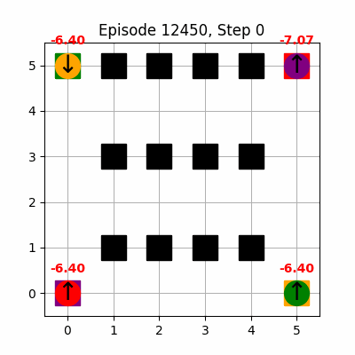

# デモ

<p align="center">
  
  
</p>

<p align="center">
  
</p>

# 使い方
本ライブラリはpython uvを使って依存関係を管理しています。
1. ```uv {仮想環境名（なんでもよい、venvなど）}```として仮想環境を作り, その中に入る
2. ```uv sync```で必要なパッケージをインストール
3. 使用するアルゴリズムのハイパーパラメータを調整。つまり、```config/{使用するアルゴリズム名}.yaml```のdefault部分を変更してください。
4. ```uv run main.py --algorithm_name "使用するアルゴリズム名"```で学習を実行します．--algorithm_name には MAT，RMAPPO，IPPO，HAPPO，QMIX，VDN のいずれかを指定できます。

   **▼ コマンド入力例**
   ```bash
   uv run main.py --algorithm_name MAT
   ```

### 補足: 実行時の詳細設定
以下のパラメータは，コマンドライン引数（`--`）で指定できます．
* `--num_rollout_threads`: 並列環境数
* `--episode_length`: エピソード長
* `--num_agents`: エージェント数
* `--num_env_steps`: 訓練する総ステップ数
* `--use_env`: 使用する環境名
* `--log_interval`: ログを表示するインターバル
* `--user_name`: ユーザー名（WandB等のログ用）

**▼ コマンド入力例**
```bash
uv run main.py --algorithm_name MAT --num_rollout_threads 32 --episode_length 50 --num_agents 4 --num_env_steps 10000000 --log_interval 1000 --user_name "DemoUser"
```


# DemoUserの環境

使い方の例を示す。Demo Userのタスクとしてマルチエージェント経路計画を用意してある。
- オレンジ、紫、赤、緑のエージェントは必ず決まった位置(赤=(0, 0), 緑=(5, 0), 紫=(5, 5), オレンジ=(0, 5))からスタートする。
- エージェントは前後左右にしか動けない。
- 黒色のマスには移動できない。枠の外に出ようとしたら、そのままとどまる。同じマス目に移動しようとしたら、オレンジ、紫、赤、緑の優先順で移動する。
- ゴールに到達したら+1
- 観測は
  [オレンジの(x,y), オレンジのゴール(x,y)] +
  [紫の(x,y), 紫のゴール(x,y)] +
  [赤の(x,y), 赤のゴール(x,y)] +
  [緑の(x,y),　緑のゴール(x,y)]
  [自分の色インデックス(オレンジなら0、紫なら1、赤なら2、緑なら3)]

# 参考資料

[JAXベースのマルチエージェント深層強化学習ライブラリ](https://github.com/instadeepai/Mava/tree/develop)がある。汎用型ではないと思うが、主要なライブラリを抑えているので今後の参考にする。


# 搭載アルゴリズム

- [x] [QMIX (ICML2018)](https://proceedings.mlr.press/v80/rashid18a/rashid18a.pdf)
- [ ] [MADDPG (NeurIPS2017)](https://proceedings.neurips.cc/paper_files/paper/2017/file/68a9750337a418a86fe06c1991a1d64c-Paper.pdf)
- [x] [IPPO (2020)](https://arxiv.org/abs/2011.09533)
- [x] [MAPPO (NeurIPS2022)](https://papers.neurips.cc/paper_files/paper/2022/file/9c1535a02f0ce079433344e14d910597-Paper-Datasets_and_Benchmarks.pdf)
- [x] [HASAC (ICLR2024)](https://openreview.net/pdf?id=tmqOhBC4a5)
- [ ] [ISAC (ICML2018)](https://proceedings.mlr.press/v80/haarnoja18b/haarnoja18b.pdf)
- [x] [HAPPO (ICLR2022)](https://arxiv.org/pdf/2109.11251)
- [ ] [HATRPO (ICLR2022)](https://arxiv.org/pdf/2109.11251)
- [x] [VDN (AAMAS2017)](https://arxiv.org/abs/1706.05296)
- [x] [MAT (NeurIPS2022)](https://proceedings.neurips.cc/paper_files/paper/2022/file/69413f87e5a34897cd010ca698097d0a-Supplemental-Conference.pdf)
